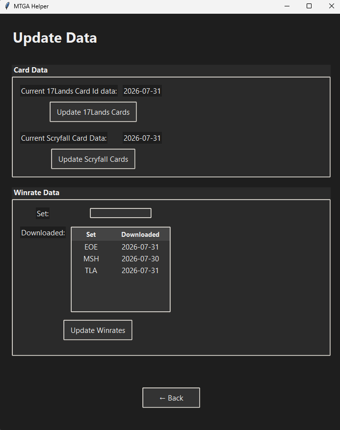
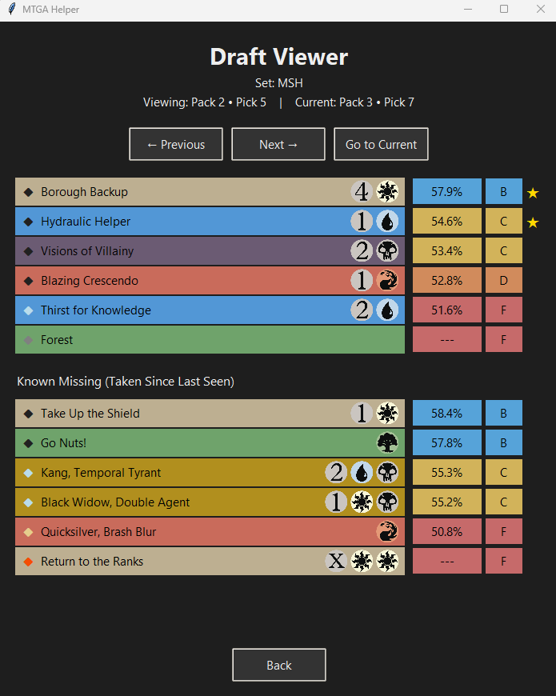

# MTGA Draft Tracker

A desktop helper application for **Magic: The Gathering Arena (MTGA) drafts** that displays live draft information, card rankings, and recommendations using data from **17Lands** and **Scryfall**.

The application monitors the MTGA log file during a draft, identifies the current pack/pick, and displays available cards ranked by historical performance data.

## Features

- **17Lands Card Rankings**
    - Displays card performance metrics from 17Lands draft data
    - Sorts available cards by Game In Hand Win Rate (GIH WR)
    - Assigns simple grades (S-F) based on winrate thresholds

- **Live Draft Tracking**
    - Reads MTGA's local log files while drafting
    - Tracks:
        - Current pack and pick
        - Previous picks
        - Selected cards
        - Cards that have disappeared from previous packs

- **Scryfall Integration**
    - Retrieves card metadata including:
        - Mana costs
        - Color identity
        - Rarity
    - Mainly used for mana symbols in the draft tracker

- **Built-in Data Management**
     Downloads and manages:
        - Local File SQLite Reading for Card GrpId Mapping
        - 17Lands winrate tables
        - Scryfall card metadata

---

## Screenshots

  
  

---

# Installation

## Requirements

- Windows
- Anaconda or Miniconda
    - Setup in default location or modify py_setup.bat file if moved
- Magic: The Gathering Arena installed

---

# Setup

Clone the repository:

    git clone <repository-url>
    cd mtga-draft-tracking

Create the Python environment:

    py_setup.bat

This will create the required Conda environment and install dependencies.

---

# Running the Application

Launch the application:

    launch_mtga.vbs

The application will open the MTGA Helper interface.

---

# First-Time Setup

Before using the draft tracker, required data files must be downloaded.

1. Open the application

2. Navigate to:

    Update Data

3. Download:

    - 17Lands Card Data
    - Scryfall Card Data
    - Winrate Data for the set you are drafting

4. Once the data has been downloaded, open:

    Draft Tracker

The application is now ready to track your MTGA drafts.

---

# How It Works

During a draft, MTGA writes information to its local log file:

    %USERPROFILE%\AppData\LocalLow\Wizards Of The Coast\MTGA\Player.log

The application monitors this file for draft updates.

The workflow:

    MTGA Draft
        |
        v
    Player.log
        |
        v
    Draft Log Parser
        |
        v
    Current Pack / Pick State
        |
        +----------------+
        |                |
        v                v
    17Lands Data     Scryfall Data
        |                |
        +----------------+
                 |
                 v
        Card Recommendations

---

# Project Structure

    mtga-draft-tracking/
    │
    ├── assets/
    │   └── mana/
    │       └── Mana symbols and UI assets
    │
    ├── data/
    │   └── Downloaded card and winrate data
    │
    ├── src/
    │   │
    │   ├── app/
    │   │   ├── main_application.py
    │   │   ├── style.py
    │   │   │
    │   │   ├── components/
    │   │   │   └── card_row.py
    │   │   │
    │   │   └── pages/
    │   │       ├── draft_tracker_page.py
    │   │       └── data_update.py
    │   │
    │   ├── utils/
    │   │   ├── draft_tracking.py
    │   │   ├── logfile_parser.py
    │   │   ├── pull_17lands_data.py
    │   │   ├── pull_scryfall.py
    │   │   └── winrates.py
    │   │
    │   └── ...
    ├── test_files/
    |   └── Used when running application in test mode, not includedin git repo
    ├── tests/
    │   └── Synthetic log generator for testing
    │
    ├── launch_mtga.vbs
    ├── py_setup.bat
    └── README.md

---

# Data Sources

This project uses publicly available card data from:

## 17Lands

Used for draft statistics and card performance metrics.

https://www.17lands.com/

## Scryfall

Used for card metadata and mana costs.

https://scryfall.com/

This project is not affiliated with Wizards of the Coast, 17Lands, or Scryfall.

---

# Development

The application can be run in test mode using synthetic draft logs:

    python -m src.app.main_application --test

This allows development without having MTGA running. 
Note, this runs with logs at the following path: test_files\\sample_draft_logs.log

---

# Future Improvements

Potential improvements:

- Overlay mode directly on top of MTGA
- Improved card recommendations using more draft context
- Background downloading/updating of data
- More detailed draft analytics
- Support for additional draft formats
- Better style, and cleaner application flow

---

# License

## License

This project is licensed under the MIT License.

Copyright (c) 2026 David Palumbo

Permission is hereby granted, free of charge, to any person obtaining a copy
of this software and associated documentation files (the "Software"), to deal
in the Software without restriction, including without limitation the rights
to use, copy, modify, merge, publish, distribute, sublicense, and/or sell
copies of the Software, and to permit persons to whom the Software is
furnished to do so, subject to the following conditions:

The above copyright notice and this permission notice shall be included in all
copies or substantial portions of the Software.

THE SOFTWARE IS PROVIDED "AS IS", WITHOUT WARRANTY OF ANY KIND, EXPRESS OR
IMPLIED, INCLUDING BUT NOT LIMITED TO THE WARRANTIES OF MERCHANTABILITY,
FITNESS FOR A PARTICULAR PURPOSE AND NONINFRINGEMENT.
